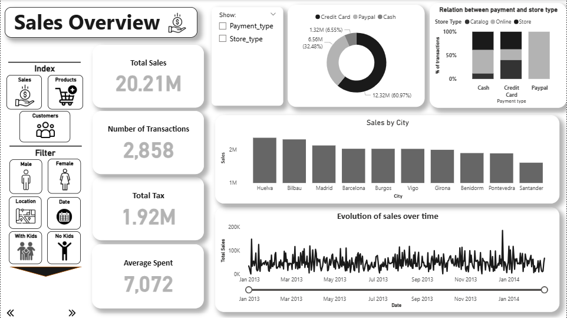

# 📊 Market Center Analytics Dashboard

## 📝 Project Overview
This project provides a comprehensive data analysis and visualization dashboard for the Market Center. It is designed to deliver actionable business insights regarding sales performance, product trends, and customer demographics for the management team.

---

## 📸 Dashboard Previews

### 1. Sales Overview
*A high-level view of revenue, trends, and overall sales performance.*

### 2. Products Performance
*Detailed analysis of product categories, top-performing items, and inventory metrics.*

### 3. Customer Insights
*Demographics, purchasing behavior, and targeted customer segmentation.*

---

## 🚀 Key Features & Insights
* **Comprehensive Reporting:** Tracks essential KPIs to monitor overall business health.
* **Visual Clarity:** Translates complex datasets into intuitive charts for quick decision-making.
* **Strategic Value:** Highlights revenue growth opportunities, product gaps, and customer preferences.

---

## 🛠️ Tools & Technologies
* **Data Processing:** Python (Pandas, NumPy) / SQL 
* **Data Visualization:** Matplotlib / Seaborn

---

## 📫 Contact
For any questions or feedback regarding this dashboard, please feel free to reach out.
